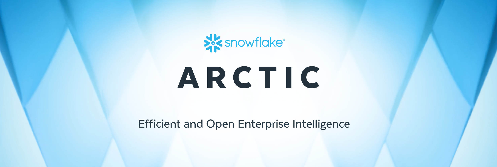

# ❄️ Snowflake Arctic ❄️

<!---->

## Latest News
* [04/24/2024] [Snowflake Arctic: The Best LLM for Enterprise AI — Efficiently Intelligent, Truly Open](https://www.snowflake.com/blog/arctic-open-and-efficient-foundation-language-models-snowflake)
    
## Overview

At Snowflake, we see a consistent pattern in AI needs and use cases from our enterprise customers. Enterprises want to use LLMs to build conversational SQL data copilots, code copilots and RAG chat bots. From a metrics perspective, this translates to LLMs that excel at SQL, code, complex instruction following and the ability to produce grounded answers. We capture these abilities into a single metric we call enterprise intelligence by taking an average of Coding (HumanEval+ and MBPP+), SQL Generation (Spider), and Instruction following (IFEval).

As seen here, Arctic is on par or better than both LLAMA 3 8B and LLAMA 2 70B on enterprise metrics, while using less than ½ of the training compute budget. Similarly, despite using 17x less compute budget, Arctic is on par with Llama3 70B in enterprise metrics like Coding (HumanEval+ & MBPP+), SQL (Spider) and Instruction Following (IFEval). It does so while remaining competitive on overall performance, for example, despite using 7x less compute than DBRX it remains competitive on Language Understanding and Reasoning (a collection of 11 metrics) while being better in Math (GSM8K).

Arctic uses a unique Dense-MoE Hybrid transformer architecture. It combines a 10B dense transformer model with a residual 128x3.66B MoE MLP resulting in 480B total and 17B active parameters chosen using a top-2 gating. To learn more about this architecture please read through our blog post here.

The Snowflake AI Research Team is thrilled to introduce Snowflake Arctic, a top-tier enterprise focused LLM that pushes the frontiers of cost-effective training and openness. Arctic is efficiently intelligent and truly open.

* Efficiently Intelligent: Arctic excels at enterprise tasks such as SQL generation, coding and instruction following benchmarks even when compared to open source models trained with significantly higher compute budgets. In fact, it sets a new baseline for cost effective training to enable Snowflake customers to create high quality custom models for their enterprise needs at a low cost. 

* Truly Open: Apache 2.0 license provides ungated access to weights and code. In addition, we are also open sourcing all of our data recipes and research insights.

## Getting Started

### Inference API Providers 🚀
You can access Arctic through your favorite API provider such as AWS, Microsoft Azure, NVIDIA Foundry, Lamini, Perplexity, Replicate and Together.

### Model Weights 🤗
The best way to get yourself running with Arctic is through Hugging Face. We have uploaded both the Base and Instruct model variants to the Hugging Face hub:

* [Snowflake/snowflake-arctic-base](https://huggingface.co/Snowflake/snowflake-arctic-base)
* [Snowflake/snowflake-arctic-instruct](https://huggingface.co/Snowflake/snowflake-arctic-instruct)

### Inference

